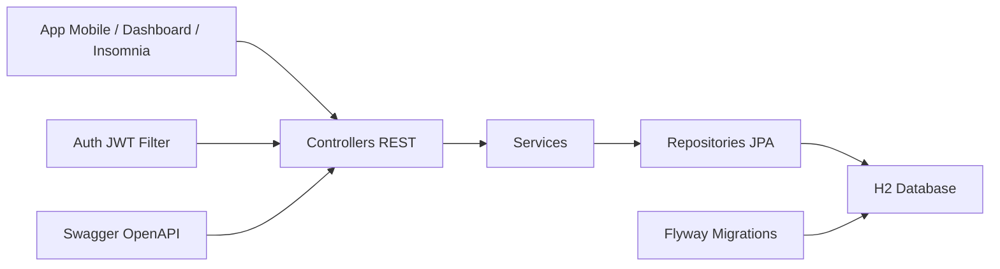

# Ford VIN Share API

API RESTful em Java + Spring Boot para o Desafio 02 da Ford FIAP 2026:
**impulsionar o VIN Share na America do Sul com solucoes inteligentes para pos-venda**.

O projeto foi pensado para a sprint de **Arquitetura Orientada a Servicos e Web Services**. Ele entrega uma API modular, com login, validacao de entradas, banco Oracle, migrations com Flyway, Swagger, Lombok e separacao clara entre controllers, services, repositories, domain e DTOs.

## Problema Atendido

O VIN Share representa a porcentagem de veiculos Ford que usam a rede oficial para manutencoes. A API ajuda concessionarias e analistas a:

- Cadastrar clientes, veiculos por VIN e concessionarias.
- Registrar ordens de servico de pos-venda.
- Gerar leads de retencao para clientes sem manutencao recente.
- Consultar indicadores de VIN Share por concessionaria, modelo e ano.

## Arquitetura



Camadas principais:

- `controller`: contrato REST e status HTTP.
- `service`: regras de negocio, VIN Share e geracao de leads.
- `repository`: acesso a dados com Spring Data JPA.
- `model`: entidades JPA e enums do negocio.
- `dto`: objetos de transferencia da API em pacote unico, sem subpastas por modulo.
- `validation`: validacao customizada de VIN.
- `security`: login, JWT e filtro de autenticacao.
- `exception`: padrao unico de erros JSON.

## Como Rodar

Configure a senha do Oracle antes de iniciar a aplicacao. No PowerShell:

```powershell
$env:ORACLE_DB_PASSWORD="sua_senha_do_oracle"
```

Depois rode:

```bash
mvn spring-boot:run
```

URLs:

- API: `http://localhost:8080`
- Swagger: `http://localhost:8080/swagger-ui`

## Banco de Dados Oracle

A aplicacao salva os dados no Oracle usado pelo SQL Developer:

| Campo | Valor |
| --- | --- |
| Host | `oracle.fiap.com.br` |
| Porta | `1521` |
| SID | `ORCL` |
| Usuario | `RM99943` |
| JDBC URL | `jdbc:oracle:thin:@oracle.fiap.com.br:1521:ORCL` |

A senha nao fica gravada no projeto. Ela e lida pela variavel de ambiente `ORACLE_DB_PASSWORD`.

O Flyway cria as tabelas e sequences automaticamente quando a aplicacao sobe pela primeira vez. Depois voce consegue consultar os dados no SQL Developer usando a conexao FIAP.

## Usuarios de Teste

| Usuario | Senha | Papel |
| --- | --- | --- |
| `admin` | `admin123` | `ROLE_ADMIN` |
| `analista` | `fiap123` | `ROLE_ANALISTA` |
| `dealer` | `dealer123` | `ROLE_CONCESSIONARIA` |

Login:

```http
POST /api/auth/login
Content-Type: application/json

{
  "username": "analista",
  "password": "fiap123"
}
```

Use o campo `accessToken` retornado no header:

```http
Authorization: Bearer SEU_TOKEN
```

## Endpoints REST

### Autenticacao

| Metodo | Endpoint | Descricao |
| --- | --- | --- |
| `POST` | `/api/auth/login` | Autentica usuario e retorna token JWT |

### Concessionarias

| Metodo | Endpoint | Descricao |
| --- | --- | --- |
| `POST` | `/api/concessionarias` | Cadastra concessionaria |
| `GET` | `/api/concessionarias` | Lista concessionarias |
| `GET` | `/api/concessionarias/{id}` | Detalha concessionaria |
| `PUT` | `/api/concessionarias/{id}` | Atualiza concessionaria |
| `DELETE` | `/api/concessionarias/{id}` | Desativa concessionaria |

### Clientes

| Metodo | Endpoint | Descricao |
| --- | --- | --- |
| `POST` | `/api/clientes` | Cadastra cliente |
| `GET` | `/api/clientes` | Lista clientes |
| `GET` | `/api/clientes/{id}` | Detalha cliente |
| `PUT` | `/api/clientes/{id}` | Atualiza cliente |

### Veiculos

| Metodo | Endpoint | Descricao |
| --- | --- | --- |
| `POST` | `/api/veiculos` | Cadastra veiculo por VIN |
| `GET` | `/api/veiculos` | Lista veiculos, com filtro opcional `modelo` |
| `GET` | `/api/veiculos/{vin}` | Detalha veiculo |
| `PUT` | `/api/veiculos/{vin}` | Atualiza veiculo |

### Ordens de Servico

| Metodo | Endpoint | Descricao |
| --- | --- | --- |
| `POST` | `/api/ordens-servico` | Registra manutencao na rede oficial |
| `GET` | `/api/ordens-servico` | Lista ordens, com filtros `vin` e `status` |
| `GET` | `/api/ordens-servico/{id}` | Detalha ordem |

### Leads de Retencao

| Metodo | Endpoint | Descricao |
| --- | --- | --- |
| `POST` | `/api/leads-retencao` | Cria lead manual |
| `POST` | `/api/leads-retencao/geracao-automatica?diasSemServico=180` | Gera leads por regra de atraso |
| `GET` | `/api/leads-retencao` | Lista leads, com filtro `status` |
| `GET` | `/api/leads-retencao/{id}` | Detalha lead |
| `PATCH` | `/api/leads-retencao/{id}/status` | Atualiza status do lead |

### Dashboard

| Metodo | Endpoint | Descricao |
| --- | --- | --- |
| `GET` | `/api/dashboard/vin-share` | Calcula indicador de VIN Share |

Filtros opcionais do dashboard:

- `concessionariaId`
- `modelo`
- `anoFabricacao`

## Exemplo de Uso

```bash
curl -X POST http://localhost:8080/api/auth/login \
  -H "Content-Type: application/json" \
  -d "{\"username\":\"analista\",\"password\":\"fiap123\"}"
```

```bash
curl http://localhost:8080/api/dashboard/vin-share \
  -H "Authorization: Bearer SEU_TOKEN"
```

## Validacoes Implementadas

- Login obrigatorio para os recursos `/api/**`.
- Token JWT assinado e com expiracao.
- VIN com 17 caracteres e sem `I`, `O` ou `Q`.
- Email valido para cliente.
- UF com duas letras.
- Datas de compra e servico nao podem estar no futuro.
- Previsao de contato do lead precisa ser hoje ou futura.
- Quilometragem e valores nao podem ser negativos.
- Erros padronizados em JSON.

## Criterios da Sprint Cobertos

- API RESTful com uso correto de `GET`, `POST`, `PUT`, `PATCH` e `DELETE`.
- Documentacao com README e Swagger.
- SOA com servicos independentes e reutilizaveis.
- Separacao entre apresentacao, negocio e dados.
- Padrao JSON para entrada e saida.
- Tratamento de excecoes e validacoes.
- Banco Oracle com Flyway para controle de migracoes.
- Lombok para reduzir getters, setters, construtores e `toString` manuais.

## Testes

```bash
mvn test
```

Resultado atual: `4 tests`, `0 failures`, `0 errors`.
